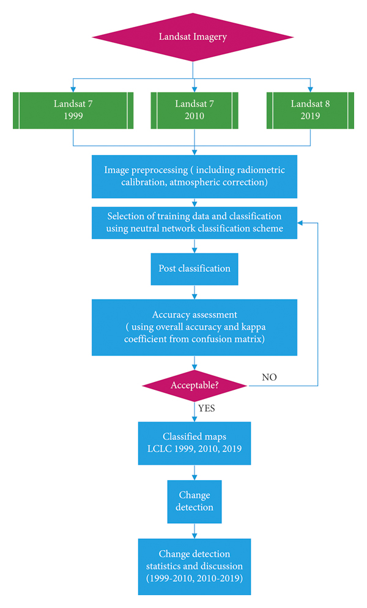
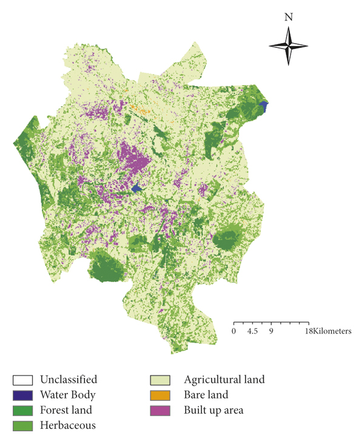
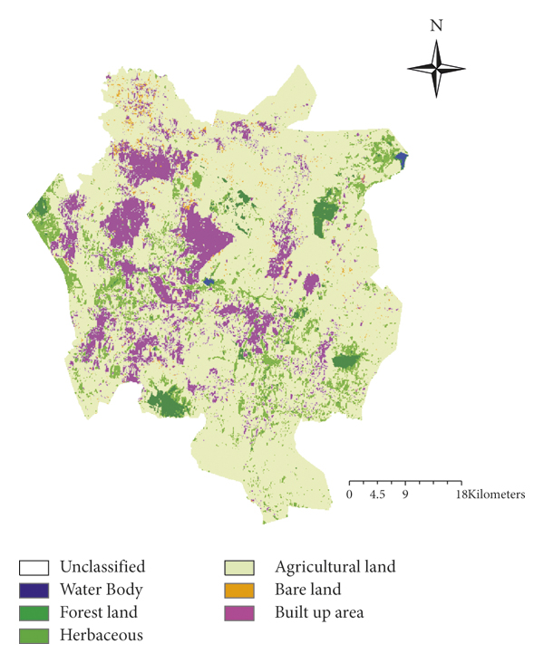
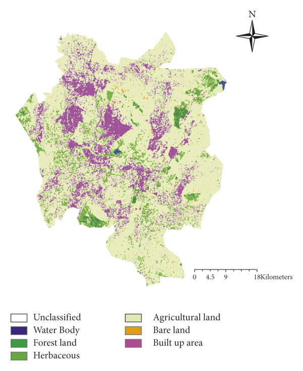
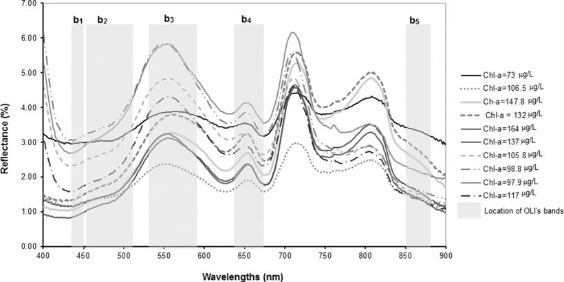

```{r include=FALSE, warning=FALSE}
library(countdown)
library(xaringan)
library(xaringanExtra)
library(knitr)
library(RefManageR)
library(knitcitations)
library(xaringanthemer)
BibOptions(check.entries = FALSE,
           bib.style = "authoryear",
           cite.style = "authoryear",
           style = "markdown",
           hyperlink = TRUE,
           dashed = FALSE,
           no.print.fields=c("doi", "url", "urldate", "issn"))
myBib <- ReadBib("./Bib.bib", check = FALSE)       
```

```{r xaringan-panelset, echo=FALSE}
xaringanExtra::use_panelset()
```

# The summary of the sensor

## Landsat8-OLI (the Operational Land Imager) 

Together with the Thermal Infrared Sensor (TIRS), they provide seasonal coverage of the global landmass at a spatial resolution of **30 meters (visible, NIR, SWIR); 100 meters (thermal); and 15 meters (panchromatic)**.OLI is a push-broom sensor with a four-mirror telescope and 12-bit quantization. 

- Launch Date: February 11, 2013
- Altitude: 705 km
- Inclination: 98.2°
- Orbit: polar, sun-synchronous
- Equatorial Crossing Time: nominally 10 AM (± 15 min.) local time (descending node)
- Period of Revolution: 99 minutes; ~14.5 orbits/day
- Repeat Coverage: 16 days
- Data: 12-bit scaled to 16-bit integers

Source:[NASA Landsat8](https://landsat.gsfc.nasa.gov/satellites/landsat-8/)

---
# The summary of the sensor
## Compares the OLI spectral bands to Landsat 7′s ETM+ bands
OLI provides two new spectral bands, one tailored especially for detecting **cirrus clouds** and the other for **coastal zone** observations.
```{r echo=FALSE, out.width='80%', fig.align='center'}
knitr::include_graphics('img/ETMvOLI-TIRS-web_Feb20131.jpg')
```
Source:[NASA Landsat8](https://landsat.gsfc.nasa.gov/satellites/landsat-8/)

---

# Examples of studies
## LULC
.pull-left[
A study in Blantyre City uses Landsat 7 Enhanced Thematic Mapper (ETM+) images from 1999 and 2010 and **Landsat 8 Operational Land Imager (OLI) images** from 2019 to **detect and quantify LULC changes** that occurred in the city throughout a twenty-year study period.
Source:`r Citet(myBib,"Gondwe2021")`
]
.pull-right[
```{r echo=FALSE, out.width='70%' }

```
]

---
# Examples of studies
## LULC
.pull-left[
.panelset[
.panel[.panel-name[LULC map for 1999]
```{r echo=FALSE, out.width='60%' }

```
]
.panel[.panel-name[LULC map for 2010]
```{r echo=FALSE, out.width='60%' }

```
]
.panel[.panel-name[LULC map for 2019]

```{r echo=FALSE, out.width='60%' }

```
]
]
]
.pull-right[
The study revealed that built-up land and agricultural land increased in their respective areas by 28.54km2 (194.81%) and 35.80km2 (27.16%). The area of bare land, forest land, herbaceous land, and waterbody, respectively, decreased by 0.05%, 90.52%, 71.67%, and 6.90%. The LULC changes in the study area were attributed to urbanization, population growth, social-economic growth, and climate change.
]
---
# Examples of studies
## Monitoring chlorophyll-a concentration (Chl-a) in inland waters
Source:`r Citet(myBib,"Ha2017")`

Urban lakes in tropical countries are under severe pressure from eutrophication and algae blooms due to massive nutrient loads from rapid urbanization, as well as humid and hot weather conditions.Remote sensing is a cost-effective near real-time monitoring technique, particularly for water trophic states estimated by Chl-a, contributing clarification of the eutrophication process for further management and decision-making. 

The best estimation was obtained by the ratio of two reflectances at 562 and 483 nm, corresponding to the ratio of the OLI band 3 versus band 2, termed the GrB2 algorithm. 
---
# Examples of studies
## Monitoring chlorophyll-a concentration (Chl-a) in inland waters

```{r echo=FALSE, out.width='60%' ,fig.align='center'}

```

(Reflectance spectra and Chl-a (μg/L) at ten points in West Lake measured on 1st June 2016)

The GrB2 values using the reflectances of water samples and the Landsat images were correlated with the Chl-a by an exponential function, and the estimated Chla were verified by the smallness of standard error.
---
# Examples of studies
In addition, landsat8 is used in ecological environment monitoring, mining environment monitoring, biomass estimation, extraction of crop planting area in reclamation area, crop growth monitoring in reclamation area, monitoring of plant diseases and insect pests in reclamation area, vegetation coverage inversion, identification of straw burning area in farmland, wetland water body monitoring, The application of urban green quantity estimation, crop planting area, reservoir storage capacity estimation, urban heat island effect inversion, surface temperature inversion, etc. is relatively mature
---
# Reflection of application examples

.pull-left[## LULC
This article describes how to identify LULC through a data collection (Landsat8 OLI) -data processing (e. g. atmospheric correction) -data analysis (ANN) -verification accuracy process.]
.pull-right[## Monitoring Chl-a
This article describes how to calculate and monitor chlorophyll-a concentration in hypertrophic waters by special bands. But it should be noted that the availability of GrB 2 is limited to waters with low levels of inorganic suspended matter, its extension to waters with much higher levels requires further investigation.]

Found that most of the studies needed to detect changes, so data for multiple sensor were selected based on the required year.
---
class: left, left

### References

.small[
```{r, results='asis', echo=FALSE}
RefManageR::PrintBibliography(myBib,start = 1, end = 2 )
```
]
